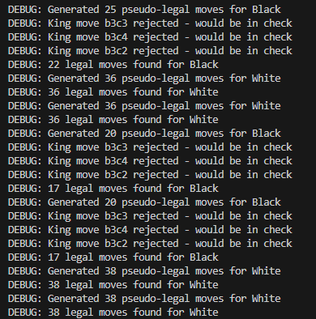

# Chess-RL: AI Chess Engine Using Reinforcement Learning
<div align="center">  </div>


Chess-RL is an AI-driven chess engine that learns and improves through reinforcement learning, inspired by AlphaZero's groundbreaking methodology. Combining the speed and efficiency of C++ with the flexibility of Python and PyTorch, Chess-RL autonomously develops chess strategies through continuous self-play and neural network training.

---

## Project Overview

This project integrates a high-performance C++ chess engine and a PyTorch neural network, trained solely through self-play. By employing reinforcement learning, Chess-RL evolves its gameplay without relying on external chess expertise or predefined strategies.

---

## Key Components

### 1. C++ Chess Engine

The foundational engine providing fast move generation and comprehensive game state management:

* `board.cpp/h`: Bitboard-based board representation, handling piece positions, castling rights, en-passant squares, and move counters.
* `movegen.cpp/h`: Fast generation of legal chess moves using efficient bitwise operations.
* `attack_tables.cpp/h`: Precomputed attack patterns stored in lookup tables, enhancing engine performance.
* `bindings.cpp`: Python bindings via pybind11 for seamless integration between the C++ engine and Python scripts.

### 2. Neural Network

A PyTorch-based network that assesses board states and selects moves:

* `model.py`: Defines the neural network with:

  * Convolutional layers for evaluating board states.
  * Policy head for generating move probabilities.
  * Value head for assessing position strength.
  * Comprehensive 18-channel board encoding for detailed position analysis.

### 3. Training Pipeline

A reinforcement learning setup that enables continuous improvement:

* `selfplay.py`: Automatically generates training data through AI self-play games.
* `train.py`: Updates neural network parameters based on self-play game outcomes.
* `python_chess.py`: Pure Python implementation for debugging and validating move generation and game logic.

### 4. Visualization and Interface

Interactive tools for understanding and observing AI decision-making:

The image below shows debug logging from the C++ engine, demonstrating how illegal king moves are identified and filtered out during move generation. It shows the engine rejecting moves that would place the king in check, ensuring only legal moves are passed to the neural network.

<div align="center">  </div>

* `pygame_gui.py`: Visual interface built with PyGame displaying the chessboard, piece moves, and highlighting the neural network’s move probabilities in real-time.

---

## Technical Implementation Details

### Board Representation

The board state is encoded into 18 distinct channels:

* **12 channels**: Piece positions (6 types × 2 colors)
* **1 channel**: Indicates side to move
* **4 channels**: Castling rights
* **1 channel**: En-passant opportunities

### Training Methodology

* **Self-Play**: AI plays games against itself, generating comprehensive training datasets.
* **Training**: Neural network parameters updated using results of these self-play games.
* **Evaluation**: New models tested against previous versions to measure performance improvements.
* **Iteration**: Continuous process iteratively enhancing the AI's playing strength.

### Move Generation

Highly optimized move generation utilizing bitboard techniques, providing comprehensive legality checks including:

* Checks and evasions
* Pin detection
* Special moves: castling, en-passant captures, and promotions

---

## Development Status

Chess-RL successfully demonstrates the principles and effectiveness of reinforcement learning within the chess domain. The hybrid approach of using both C++ (performance optimization) and Python (rapid development and visualization) offers a balance of efficiency and flexibility. Visualization tools provide clear insights into the AI's decision-making process during training and gameplay.

---

## Repository Link

[Chess-RL GitHub Repository](https://github.com/imjbassi/chess-reinforcement-learning)

---

## Getting Started

### Prerequisites

* C++ Compiler (e.g., GCC, MSVC)
* Python 3.x
* PyTorch
* PyGame
* pybind11

### Installation

```bash
git clone https://github.com/imjbassi/chess-reinforcement-learning.git
cd chess-reinforcement-learning
pip install -r requirements.txt
```

### Usage

Run the PyGame visualization:

```bash
python python/gui/pygame_gui.py
```

Train the neural network:

```bash
python train.py
```

Generate self-play games:

```bash
python selfplay.py
```

---

## Contributions

Contributions, feature requests, and bug reports are welcome. Please open an issue or submit a pull request.

---

## License

This project is licensed under the MIT License – see the [LICENSE](LICENSE) file for details.
